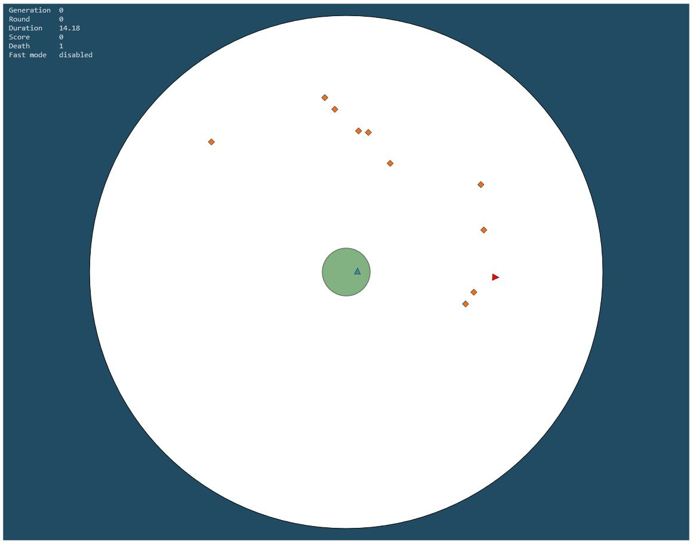

Wild Neurons
========================

[Github](https://github.com/merry-goblin/wild-neurons)

### Purpose

Old project about creatures which learn through genetic algorithms

### Description

A squirrel has to eat nuts and not being eaten by a wolf
A wolf has to eat this squirrel
A squirrel is safe in the world center

[]

--------------------------

author : [alexandre keller](https://github.com/merry-goblin)